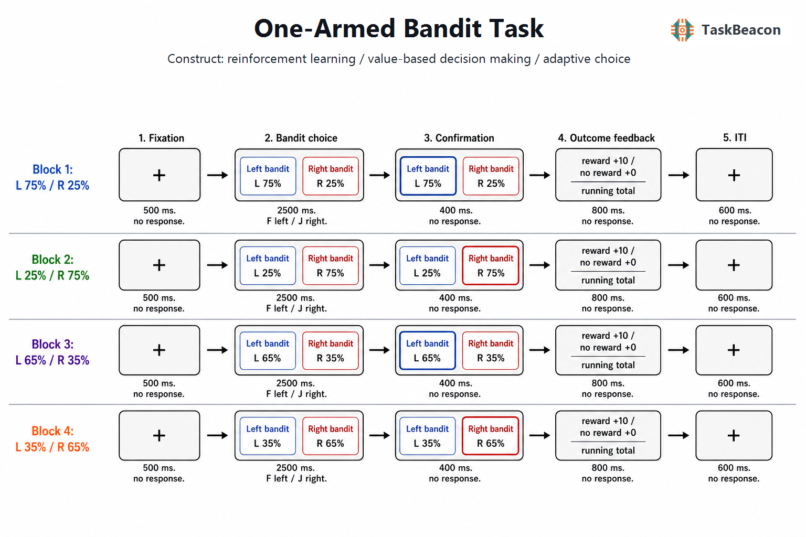

# 两臂老虎机任务：概率性强化学习、适应性选择及其测量边界

不确定环境中的选择要求个体同时解决两个相互制约的问题：依据既往结果提高当前收益，以及通过选择信息不足的选项改善后续决策。老虎机任务把这一问题转化为可重复观测的序列决策：每个“臂”对应一个未知或变化的结果分布，选择只揭示被选选项的结果，因而每次反应既产生收益，也改变下一次选择所依据的信息。该范式由序贯实验设计中的两臂与多臂老虎机问题发展而来（Robbins, 1952），随后成为研究强化学习、探索—利用权衡和环境变化适应的核心工具。TaskBeacon 项目所称“One-Armed Bandit Task”在操作上提供左右两个选项，故本文按实验结构称其为“两臂老虎机任务”；“one-armed bandit”在此指单台老虎机的习惯性名称，不表示实验只有一个可选项。

## 1. 范式提出与理论背景

Robbins（1952）提出的序贯分配问题关注：当多个收益分布未知时，如何在有限抽样中分配选择，使累积损失相对于始终选择最优选项的策略尽可能小。心理学实验据此将抽象的“臂”呈现为图形、牌组或老虎机，并逐试次给出概率性结果。研究对象因而从最优策略的数学性质扩展为人类如何学习行动价值、表征不确定性以及在环境改变后调整选择。

模型自由指标可直接描述行为，包括高收益选项选择率、反应时、累计收益、赢后保持（win-stay）和输后转换（lose-shift）。强化学习模型则通常令已选行动价值按预测误差更新：结果优于预期时价值上调，劣于预期时价值下调；学习率控制新结果相对既往经验的权重，softmax 逆温度控制选择对价值差的敏感性（Sutton & Barto, 2018）。对正、负预测误差设置不同学习率可检验结果效价不对称，加入选择黏滞项可区分价值学习与单纯重复倾向。概率反转进一步要求模型随环境波动性降低旧证据的权重。简单的固定学习率、可变学习率、贝叶斯信念更新和带不确定性的探索模型可以产生相似的表面选择率，因此参数恢复与模型比较是构念解释的必要组成部分（Averbeck, 2015; Danwitz et al., 2022）。

## 2. 任务逻辑、流程与核心参数

经典两臂版本在一个区块内重复呈现两个选项。参与者在限定时间内选择其一，只观察所选项的奖励或未奖励结果，再进入下一试次。若选项 A、B 的奖励概率分别为 0.75 和 0.25，持续偏向 A 表明利用已学价值；选择 B 可能来自随机选择、探索、反应偏好或价值估计误差，不能仅凭单一试次判定其心理含义。显式操纵选项信息量或未来选择次数，才能更有力地区分以减少不确定性为目的的定向探索与选择噪声增加所形成的随机探索（Wilson et al., 2014; Gershman, 2018）。

区块内固定、区块间反转的设计侧重概率性学习和规则改变后的再适应。反转前的高收益选项选择率反映价值辨别；反转后的转换潜伏期、学习曲线斜率及输后转换反映旧价值保持与新证据整合。若反转时点可预测，参与者还可能学习区块结构，而不只是更新行动价值。相比之下，游走型（restless）老虎机让均值连续变化，地平线任务操纵未来可用选择次数与初始信息不平衡，分别更适于估计波动适应及定向/随机探索（Daw et al., 2006; Wilson et al., 2014）。这些版本并不共享一个可直接互换的“探索”指标。

结果反馈既是强化事件，也是下一次学习的输入。奖励预测误差只能在给定模型的主观期望下定义，中奖不必然等于正预测误差，未中奖也不必然等于负预测误差。反馈符号本身的效价与语义冲突还会改变奖励正波等脑电反应，提示视觉符号、结果效价和预期偏差需要在设计与分析中分离（Hammerstrom et al., 2021）。无反应后的随机代选、未选选项反馈以及是否兑现积分同样会改变控制感、反事实学习和激励强度，均应预先说明。

## 3. 主要行为与神经科学发现

### 3.1 行动价值学习与探索—利用权衡

概率性选择的稳定群体效应是：随着反馈积累，高收益选项选择率上升；概率反转后，该优势先下降再重新建立。人类并非只采用一种探索规则。地平线任务表明，未来选择机会增多时，对信息较少选项的偏好和选择随机性可以分别增加，支持定向探索与随机探索的操作性区分（Wilson et al., 2014）。在明确给出风险结构的两臂任务中，混合模型同样优于单一规则，说明相对不确定性与总体不确定性可通过不同计算影响选择（Gershman, 2018）。这些证据来自针对信息量与地平线的专门操纵；对于仅设置固定概率并在区块间反转的任务，非最优选择至多可解释为探索候选指标。

强化学习参数有助于压缩逐试次行为，但参数名称不等于心理过程已被识别。学习率可同时吸收注意波动、遗忘、反转预期和模型失配，逆温度则可能混合探索、运动失误与价值估计噪声。游走型老虎机的模拟研究显示，模型与参数恢复显著依赖试次数、生成参数范围和候选模型集合（Danwitz et al., 2022）。因此，应同时报告可观察行为、模型后验预测检查和参数恢复结果，而不宜只比较最佳拟合参数。

### 3.2 fMRI 与 EEG 所见的阶段性过程

功能磁共振成像（functional magnetic resonance imaging, fMRI）研究把选择期与结果期分离后发现，结果期的纹状体活动可随模型估计的奖励预测误差变化；腹侧与背侧纹状体在价值预测和行动选择中的贡献部分可分离（O'Doherty et al., 2004）。药理学操纵进一步显示，增强或抑制多巴胺功能会同时改变纹状体预测误差信号与高收益行动选择倾向（Pessiglione et al., 2006）。学习者相较未形成稳定偏好的参与者表现出更明确的纹状体强化学习信号（Schönberg et al., 2007）。这些结果支持皮质—纹状体网络参与概率性工具学习，但血氧水平依赖（BOLD）相关不能单独确定局部活动对行为的因果作用。

探索研究将选择期信号与模型分类相结合。游走型多臂任务中，额极皮层与顶内沟对探索性选择更敏感，而纹状体和腹内侧前额叶活动更符合基于已学价值的利用（Daw et al., 2006）。在两臂任务中，相对不确定性与定向探索关联于右侧吻侧外侧前额叶活动，总体不确定性与随机探索关联于右侧背外侧前额叶活动（Tomov et al., 2020）。近期概率反转研究进一步把内侧前额叶的试次间信号变异与波动环境中的适应性选择联系起来（Findling et al., 2025）。上述结论依赖特定模型和任务操纵，不能据某次非最优选择反推额叶“探索状态”。

脑电图（electroencephalography, EEG）提供反馈加工的时间信息。概率性强化学习中，反馈后的额中线 theta 活动随负预测误差变化，并与下一试次的行为调整相关（Cavanagh et al., 2010）。两臂老虎机研究也表明，反馈符号与结果意义冲突时，奖励正波及 P300 会改变（Hammerstrom et al., 2021）。这类结果支持反馈后数百毫秒内存在与预期偏差和行为更新相关的快速过程；头皮电位同时受效价、显著性和刺激语义影响，其空间来源与单一计算量的对应关系需保持审慎。

## 4. 范式发展与主要应用

该范式的关键发展是将“选得是否更优”分解为可检验的学习成分。正、负结果分离推动了多巴胺与基底节研究：帕金森病患者停药时更擅长从负反馈回避，服用多巴胺药物后偏向从正反馈学习，说明药物状态会改变效价不对称，且临床组差异不能简化为一般学习能力降低（Frank et al., 2004）。发展研究通过部分与完整反馈条件发现，青少年与成年人在反事实结果利用及奖惩情境化方面存在差异（Palminteri et al., 2016）。这些变式改变了反馈信息结构，所得结论不应直接外推到只呈现已选结果的版本。

计算精神病学常把学习率、结果敏感性或探索参数视作跨诊断表型。情绪与焦虑障碍的系统综述和元分析显示，不同任务、样本与模型所得差异具有明显异质性，尚不足以把单一参数作为个体诊断标志（Pike & Robinson, 2022）。2025 年跨三类少臂老虎机任务的研究进一步发现，同类探索参数的重测信度多为较差至中等，跨任务相关很小；简化模型后可提取价值导向与定向探索因子，但其与焦虑、抑郁和自陈探索倾向并无稳定关联，并与工作记忆表现高度相关（Witte et al., 2025）。临床应用因而更适合检验有明确先验的组水平机制或纵向变化，而非据单次任务输出作个体分类。

## 5. 测量效度与解释边界

构念效度首先取决于操纵是否能识别目标过程。固定概率加区块反转可以测量反馈驱动的价值更新和规则变化后的适应，但没有独立操纵信息量、风险与地平线时，难以区分定向探索、随机探索、价值噪声和反应失误。固定左右位置还可能混入侧偏；若视觉身份随位置变化，则可进一步区分刺激价值与运动反应价值。仅反馈已选结果时，未选项价值不可直接观察，反事实学习也无法估计。

重测研究对个体差异推断提出了更直接的限制。Schaaf 等（2024）在两臂老虎机与反转学习任务中发现，五周间隔下老虎机的正确率信度较低，赢后保持和输后转换约为中等，而多数强化学习参数的组内相关较差；层级贝叶斯估计虽改善部分参数，仍未普遍达到个体表型所需水平。跨任务研究也显示，同名探索参数并不必然具有收敛效度（Witte et al., 2025）。研究设计应增加有效试次数，平衡选项位置与反转结构，预先检验参数恢复，并把群体平均学习效应、个体排序信度和临床预测效度分别报告。

外部效度还受激励与环境结构限制。积分是否兑现会影响动机；明确或隐蔽的概率、固定或不可预测的反转、二元或连续结果会改变最优策略。实验中的探索具有明确的选项集合与短期收益函数，不能无条件代表日常好奇心、风险偏好或人格特质。神经指标同样是任务条件下的相关活动差异，不能由脑区激活直接推出稳定特质或因果机制。

## 6. TaskBeacon 中的任务实现

### 6.1 任务资源与访问入口

| 资源 | ID | 用途 | 地址 |
|---|---|---|---|
| 完整实验实现 | T000020 | PsychoPy 行为采集版本 | [GitHub](https://github.com/TaskBeacon/T000020-one-armed-bandit) |
| 浏览器预览源码 | H000020 | `psyflow-web` 行为型原型 | [GitHub](https://github.com/TaskBeacon/H000020-one-armed-bandit) |
| 在线体验 | H000020 | 浏览器预览入口 | [运行页面](https://taskbeacon.github.io/psyflow-web/?task=H000020-one-armed-bandit) |

H000020 用于网页体验和流程预览，不替代本地 PsychoPy 版本在实验室环境中的时序控制与数据采集。

### 6.2 实现流程与关键参数

TaskBeacon 当前版本包含 4 个区块、每区块 40 个试次，共 160 次选择。各区块左右奖励概率依次为 0.75/0.25、0.25/0.75、0.65/0.35 和 0.35/0.65；概率在区块内固定，选定一侧的结果按对应 Bernoulli 分布抽样。参与者按 F 选择左侧、按 J 选择右侧，中奖增加 10 分，未中奖增加 0 分并显示累计得分。该实现不使用在线难度控制器；其适应要求来自预定的区块间概率交换。现有仓库文件无法确认积分是否兑换为实际金钱。

**图 1. TaskBeacon 当前实现的区块与试次结构。** 图中百分比用于标注研究者设定的潜在奖励概率；参与者界面以“左侧机器”和“右侧机器”呈现选项。单试次依次为 500 ms 注视、最长 2500 ms 的左右选择、400 ms 选择确认、800 ms 中奖或未中奖反馈及累计得分、600 ms 试次间注视。F/J 分别映射左/右；中奖计 10 分，未中奖计 0 分。四区块分别采用 75%/25%、25%/75%、65%/35% 和 35%/65% 的左右概率，每区块 40 个试次。超过反应时限时，程序按预设随机策略代选并记录该试次，分析时应将代选与自主反应区分。任务没有逐试次自适应调节，区块间概率交换构成主要环境变化。

主要记录量包括选择键、选择侧、反应时、左右概率、中奖状态、单试次得分和累计得分。由此可计算高概率侧选择率、反转后的调整曲线、赢后保持和输后转换，也可拟合强化学习模型。由于选项始终以左右位置定义，侧偏与行动价值在当前设计中部分重合；又因反转只发生在区块边界，参与者可能利用区块顺序或休息提示。上述特征使该实现适合演示概率性反馈学习和区块级适应，但若研究目标是分离不确定性驱动的探索或无提示的波动性推断，则需增加相应操纵。

## 参考文献

Averbeck, B. B. (2015). Theory of choice in bandit, information sampling and foraging tasks. *PLOS Computational Biology, 11*(3), e1004164. https://doi.org/10.1371/journal.pcbi.1004164

Cavanagh, J. F., Frank, M. J., Klein, T. J., & Allen, J. J. B. (2010). Frontal theta links prediction errors to behavioral adaptation in reinforcement learning. *NeuroImage, 49*(4), 3198–3209. https://doi.org/10.1016/j.neuroimage.2009.11.080

Danwitz, L., Mathar, D., Smith, E., Tuzsus, D., & Peters, J. (2022). Parameter and model recovery of reinforcement learning models for restless bandit problems. *Computational Brain & Behavior, 5*(4), 547–563. https://doi.org/10.1007/s42113-022-00139-0

Daw, N. D., O'Doherty, J. P., Dayan, P., Seymour, B., & Dolan, R. J. (2006). Cortical substrates for exploratory decisions in humans. *Nature, 441*, 876–879. https://doi.org/10.1038/nature04766

Findling, C., Romand-Monnier, M., Skvortsova, V., & Koechlin, E. (2025). Neural variability in the medial prefrontal cortex contributes to efficient adaptive behavior. *Nature Communications, 16*, 11356. https://doi.org/10.1038/s41467-025-66444-x

Frank, M. J., Seeberger, L. C., & O'Reilly, R. C. (2004). By carrot or by stick: Cognitive reinforcement learning in parkinsonism. *Science, 306*(5703), 1940–1943. https://doi.org/10.1126/science.1102941

Gershman, S. J. (2018). Deconstructing the human algorithms for exploration. *Cognition, 173*, 34–42. https://doi.org/10.1016/j.cognition.2017.12.014

Hammerstrom, M. R., Ferguson, T. D., Williams, C. C., & Krigolson, O. E. (2021). What happens when right means wrong? The impact of conflict arising from competing feedback responses. *Brain Research, 1761*, 147393. https://doi.org/10.1016/j.brainres.2021.147393

O'Doherty, J., Dayan, P., Schultz, J., Deichmann, R., Friston, K., & Dolan, R. J. (2004). Dissociable roles of ventral and dorsal striatum in instrumental conditioning. *Science, 304*(5669), 452–454. https://doi.org/10.1126/science.1094285

Palminteri, S., Kilford, E. J., Coricelli, G., & Blakemore, S.-J. (2016). The computational development of reinforcement learning during adolescence. *PLOS Computational Biology, 12*(6), e1004953. https://doi.org/10.1371/journal.pcbi.1004953

Pessiglione, M., Seymour, B., Flandin, G., Dolan, R. J., & Frith, C. D. (2006). Dopamine-dependent prediction errors underpin reward-seeking behaviour in humans. *Nature, 442*, 1042–1045. https://doi.org/10.1038/nature05051

Pike, A. C., & Robinson, O. J. (2022). Reinforcement learning in patients with mood and anxiety disorders vs control individuals: A systematic review and meta-analysis. *JAMA Psychiatry, 79*(4), 313–322. https://doi.org/10.1001/jamapsychiatry.2022.0051

Robbins, H. (1952). Some aspects of the sequential design of experiments. *Bulletin of the American Mathematical Society, 58*(5), 527–535. https://doi.org/10.1090/S0002-9904-1952-09620-8

Schaaf, J. V., Weidinger, L., Molleman, L., & van den Bos, W. (2024). Test–retest reliability of reinforcement learning parameters. *Behavior Research Methods, 56*(5), 4582–4599. https://doi.org/10.3758/s13428-023-02203-4

Schönberg, T., Daw, N. D., Joel, D., & O'Doherty, J. P. (2007). Reinforcement learning signals in the human striatum distinguish learners from nonlearners during reward-based decision making. *The Journal of Neuroscience, 27*(47), 12860–12867. https://doi.org/10.1523/JNEUROSCI.2496-07.2007

Sutton, R. S., & Barto, A. G. (2018). *Reinforcement learning: An introduction* (2nd ed.). MIT Press.

Tomov, M. S., Truong, V. Q., Hundia, R. A., & Gershman, S. J. (2020). Dissociable neural correlates of uncertainty underlie different exploration strategies. *Nature Communications, 11*, 2371. https://doi.org/10.1038/s41467-020-15766-z

Wilson, R. C., Geana, A., White, J. M., Ludvig, E. A., & Cohen, J. D. (2014). Humans use directed and random exploration to solve the explore–exploit dilemma. *Journal of Experimental Psychology: General, 143*(6), 2074–2081. https://doi.org/10.1037/a0038199

Witte, K., Thalmann, M., & Schulz, E. (2025). Model-based exploration is measurable across tasks but not linked to personality and psychiatric assessments. *Scientific Reports, 15*, 27479. https://doi.org/10.1038/s41598-025-09152-2
